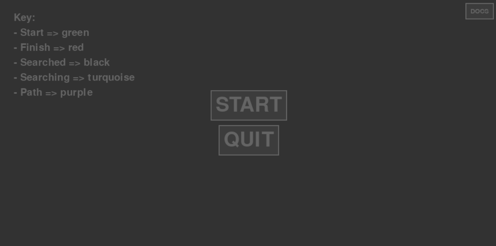
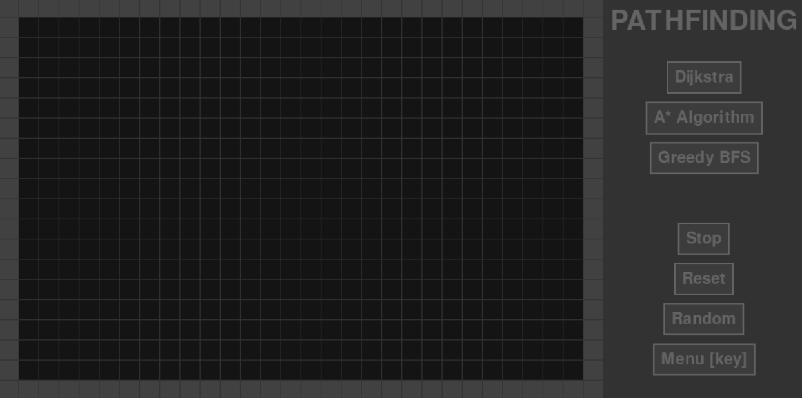
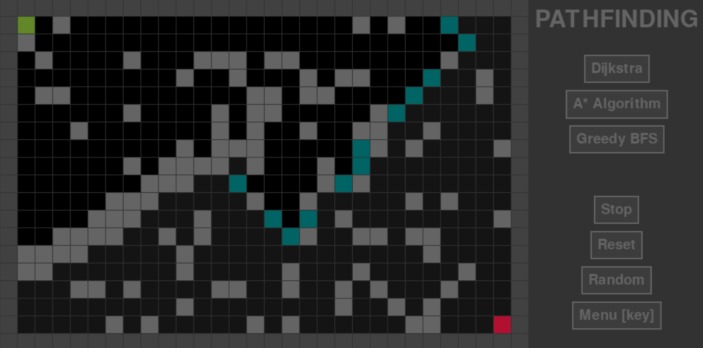
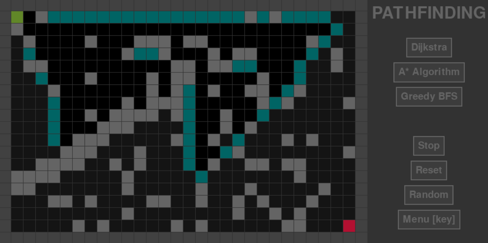
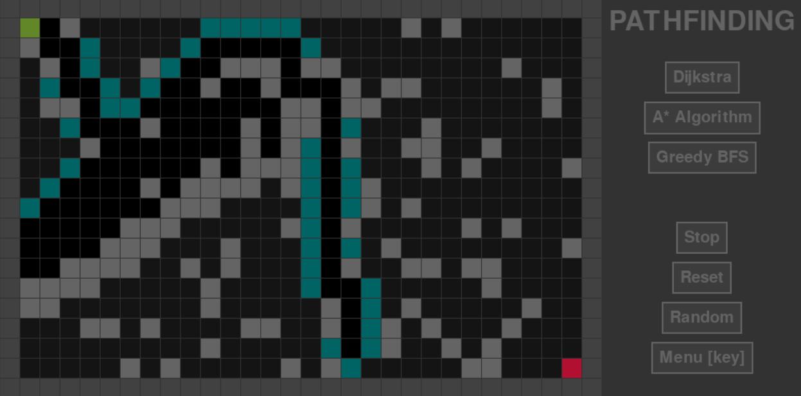
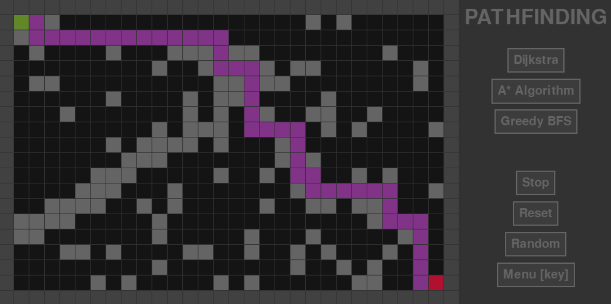

# Pathfinding Visualisation Tool

An interactive Python application that visualises and compares pathfinding algorithms, demonstrating their efficiency and time complexity.  

## Contents
- [Overview](#overview)  
- [Features](#features)  
- [Algorithms Implemented](#algorithms-implemented)  
- [Usage](#usage)
- [Preview](#preview) 

## Overview

This project is designed to help users understand the behaviour and efficiency of common pathfinding algorithms. Users can set start and end points, add obstacles, and watch the algorithms explore the grid in real time. It is both an educational tool and a demonstration of interactive visualisation using Python.  

## Features

- Interactive grid interface for setting start, end, and obstacle points.  
- Real-time visualisation of pathfinding algorithms.  
- Comparison of algorithm efficiency based on number of steps explored.  
- Ability to reset and modify the grid dynamically.  

## Algorithms Implemented

- **A*** (A-Star) – Uses heuristics to find the shortest path efficiently.  
- **Dijkstra's Algorithm** – Guarantees the shortest path without heuristics.  
- **Breadth-First Search (BFS)** – Explores all nodes level by level.  

## Usage
- Left-click: Place start, end, or obstacle nodes
- Right-click: Remove nodes
- Escape: return to menu
- Colour key
  - Start: green
  - Finish: red
  - Searched: black
  - Searching: turquoise
  - Path: purple
 - recommended cell size: 25
 
## Preview

### Menu

### Main Grid

### Dijkstra's Algorithm

### A* Algorithm

### Greedy BFS Algorithm

### Path solved

